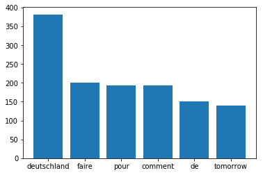

# Syntax Analyse / Information Retrieval anhand des Textkorpus “Je Suis Autocomplete”

*In den letzten zwei Jahren sind innerhalb des Projektes "Je Suis Autocomplete" Textdaten aus Google und Bings Autocomplete Api gespeichert worden. Diese Texte sollen nun hier untersucht werden*

Vor allem sollen folgende Fragen im Vordergrund stehen:
Wie ist der Syntax der “AutovervollständigtenSätze” in der Datenbank beschaffen? Wovon handeln Sie? 


## Inhaltsverzeichnis:
* [Aktueller Stand des Projekts](#0)
* [Wie ist das Corpus entstanden?](#1)
* [Bestand SQL Datenbank ](#2)
* [1.1 Bestandsaufnahme - SQL DB in Python Array einlesen und Tokens bilden](#3)
* [1.2 Bestandsaufnahme - Verteilung: Anzahl Wörter pro Satz](#4)
* [1.3 Bestandsaufnahme - Am häufigsten vorkommende Wörter](#5)
* [1.4 Definition von Stopp Wörtern ](#6)
* [2.1 Syntax Analyse   - POS Tagging: Mapping von deutschen Wortarten auf "Universelle"- Wortarten](#8)
* [2.2 Syntax Analyse   - Versuch des POS-Tagging](#9)

## Aktueller Stand <a class="anchor" id="0"></a>

Zum gegenwärtigen Zeitpunkt der hier versuchten Analyse -mittles Python und nltk-  kann man über den Syntax der vielen Einzelsätze des Korpus lediglich folgendes sagen: 

* Die meisten Sätze enthalten zwei bis fünf Wörter [<i>(siehe Kapitel 1.2)</i>](#4)

* Das Korpus enthält c.a. 61 000 Verben

* In über 80 % Prozent der Sätze stehen die Verben an zweiter Stelle

* Diese Verben sind meistens infinitiv

* Die Wörter "Arbeiten", "Glauben","Lieben" sind was die Häufigkeit der verwendung angeht ganz weit oben und direkt an benachbarter "Stelle". [<i>(siehe Kapitel 2.3)</i>](#7)

* Eine eindeutige bestimmung aller Wortarten eines gegebenen Satzes funktioniert momentan -bis auf Verben- leider noch sehr schlecht. 

Die ungenügende Bestimmung aller Wortarten hat wahrscheinlich folgende Gründe: 

Die zu untersuchenden Sätze sind in deutscher Sprache. Es gibt noch keine POS-Tagging Library innerhalb Pythons, die für die deutsche Sprache trainiert wurde. 

Hier: https://github.com/ptnplanet/NLTK-Contributions (ptnplanet) findet allerdings den "ClassifierBasedGermanTagger". Der anhand des Deutschen "Tiger Corpus" trainiert wurde. Angeblich kommt dieser auf eine genauigkeit von 96,6 %. 
Nicht aber innerhalb des jesuisautocomplete Korpuses. 
Denn: Die zu untersuchenden Sätze sind häufig ohne Unterscheidung zwischen Groß- und Kleinschreibung.
Darauf war der ClassifierBasedGermanTagger wohl nicht vorbereitet. 
Außderm sind viele der "Suchanfragen"-Sätze wohl in "verkrüppeltem" oder gar "falschem syntax". Hier beißt sich allerdings die Katze in den Schwanz. Denn wir wollen ja gerade mehr die Abweichung von "Suchmaschinen Deuztsch" zu "Normalem Deutsch" erfahren. 
Ein nltk "Tagger" gibt aber keine Auskunft darüber warum oder wie er ein bestimmtes Wort klassifiziert, sondern tut es einfach. 

Was nun? 

Entweder man "trainiert" nun seinen "eigenen" Tagger an einem möglichst naivem Textkorpus oder man greift auf eine Datenbank 
wie WordNet (GermaNet) zurück. Diese würde dann einfach Wörter anhand von statischen Listen analysieren, was für mein vorliegendes Korpus wahrscheinlich einen Versuch wert wäre.


## Wie ist der Corpus entstanden? <a class="anchor" id="1"></a>

Das Textcorpus "jesuisautocomplete" entstand 2016 als Abschlusprojekt im Rahmen von "Musik&Text". 
Auf der Website des Projekts sieht der Benutzer einen Videoloop der eine Talkshow abbildet. In dem Video werden außerdem gelbe Untertitel zum Bild angezeigt. Es gibt keine Audiospur zum Bild. 

Der Nutzer kann einen Suchbegriff (oder Satzanfang eingeben) in eine Maske eingeben. Dieser wird zur "Google/ Bing" Autocomplete API gesendet. Die Ergebnisse werden dann als Untertitel auf dem Videoloop angezeigt, so dass der Eindruck erweckt wird die Figuren im Video würden sich mit und über die automatisch vervollständigten Queries "unterhalten". 

Die Datenbank im Hitnergrund der Website jesuisautocomplete.org Sammelte diese Anfragen sowie alle durch die Query der APIs zurückgegeben Daten. Innerhalb von ein paar Monaten stieg die Anzahl der gesammelten Sätze auf c.a. 70 000 an, da pro Satzfragment für eine Anfrage c.a. 100 Autovervollständigte "Sätze" zurückgegeben werden- 

Um noch etwas mehr Material an zu sammeln, habe ich noch einige statische Listen erzeugt, die über Cronjobs immer wieder naive Satzfragmente aus Listen konstruieren und an die Api schicken. (siehe Abb.2)


## Bestand der SQL Datenbank <a class="anchor" id="2"></a>


## SQL DB Abfragen, in Py Array speichern und Tokens bilden <a class="anchor" id="3"></a>


```python
import mysql.connector
import itertools

db = mysql.connector.connect(host="*******",user="instabilothek",password="*******",database="jesuisautocomplete", port="3306" )

cursor = db.cursor()

query = "SELECT DISTINCT results FROM jesuisautocomplete_ger WHERE LENGTH(results) ORDER BY RAND()"

cursor.execute(query)
rows = cursor.fetchall()

autocompleted = []

for row in rows:
    autocompleted.append(row)
    
l_autocompleted = list(itertools.chain.from_iterable(autocompleted))
str_autocompleted = " ".join(l_autocompleted)

tkn_autocompleted = str_autocompleted.split() 
    
```

## Verteilung der Anzahl der Wörter Pro Satz im gesamten Textkorpus <a class="anchor" id="4"></a>


```python
import re
from nltk import FreqDist
import numpy as np
import matplotlib.pyplot as plt

import reprlib   

r = reprlib.Repr()
r.maxlist = 50  
r.maxstring = 200
r.maxset = 100

wortanzahl = []

for wort in l_autocompleted:
    wortanzahl.append(sum(1 for space in re.finditer(r"[^\s]+", wort)))
    
print(r.repr(wortanzahl))

frequenz_wortanzahl = FreqDist(wortanzahl)

print(r.repr(frequenz_wortanzahl.most_common(10)))

#n, patches = plt.hist(*zip(*frequenz_wortanzahl.most_common(5)),normed=1, facecolor='blue', alpha=0.75)

plt.axis([1, 8, 0, 200000])
plt.grid(True)
plt.xlabel(u'Anzahl Wörter pro Satz')
plt.ylabel(u'Häufigkeit innerhalb des Korpuses')
plt.title("")


plt.bar(*zip(*frequenz_wortanzahl.most_common(5)), linewidth=0)
plt.show
    
```

    [6, 5, 2, 5, 2, 4, 3, 2, 2, 4, 3, 3, 3, 5, 3, 4, 3, 2, 5, 3, 4, 4, 2, 3, 2, 8, 4, 5, 2, 3, 3, 3, 3, 2, 2, 2, 3, 2, 2, 2, 2, 2, 2, 2, 3, 2, 4, 3, 2, 2, ...]
    [(2, 153123), (3, 95855), (4, 44529), (5, 21917), (6, 12102), (7, 6204), (1, 3210), (8, 3094), (9, 1681), (10, 1018)]
    


    <function matplotlib.pyplot.show>


## Suche der am häufigsten vorkommenden Wörter


```python
                 #OUTPUT STRING LEN() LIMITIEREN
#import backports
#import requests
import bs4
import nltk
from nltk import FreqDist
import reprlib   

r = reprlib.Repr()
r.maxlist = 50  
r.maxstring = 200
r.maxset = 100

frequency = FreqDist(tkn_autocompleted)

print(r.repr(l_autocompleted))
print("++++++++++++++++++++++++++++++++++++++++++++++++")
print("                                                ")
print("++++++++++++++++++++++++++++++++++++++++++++++++")
print(r.repr(frequency.most_common(50)))
```

    [u'gefund...e text\n', u'immer ...timmer\n', u'kinder... jeans\n', u'an kei...e4tsel\n', u'intere...mputer\n', u'was pa...auchen\n', u'bewerb...m 2018\n', u'religi...uechua\n', u'pokemon zygarde\n', u'wie we...teuert\n', u'khan r...enburg\n', u'jedes ...etting\n', u'erlebn...hessen\n', u'how to...atsapp\n', u'cup no...s test\n', u'du und... lines\n', u'blumen...gratin\n', u'deklin...erator\n', u'du da ...r\xfcn\n', u'abmeld...artz 4\n', u'es tan...zemann\n', u'vor un...glisch\n', u'invest...ichtig\n', u'anbiet...rkarte\n', u'wetter zagreb\n', u'wie br...chwung\n', u'schwei...p 2018\n', u'das ja...wochen\n', u'schlaf...ckreiz\n', u'guter ...outube\n', u'wegfah... zweit\n', u'person... jeder\n', u'tunnel...unfall\n', u'deswegen dict\n', u'fallen schuhe\n', u'man zypper\n', u'shop o...artner\n', u'frisuren braun\n', u'defini...worren\n', u'verdam...nglish\n', u'guitar...mental\n', u'gemmin...inghof\n', u'gekenn...ionary\n', u'schwac...izienz\n', u'schlaf...grippe\n', u'gesich...uneben\n', u'was pa...enkuss\n', u'lld json zabbix\n', u'code civil\n', u'mittel...locken\n', ...]
    ++++++++++++++++++++++++++++++++++++++++++++++++
                                                    
    ++++++++++++++++++++++++++++++++++++++++++++++++
    [(u'ich', 8269), (u'in', 7781), (u'der', 7305), (u'und', 7081), (u'englisch', 6273), (u'wie', 5682), (u'ist', 5637), (u'auf', 4837), (u'nicht', 4745), (u'mit', 4079), (u'die', 3974), (u'was', 3800), (u'zu', 3763), (u'hat', 3736), (u'im', 3473), (u'sie', 3472), (u'es', 3454), (u'oder', 3187), (u'warum', 2991), (u'mich', 2904), (u'von', 2753), (u'the', 2696), (u'ein', 2679), (u'du', 2622), (u'mir', 2589), (u'nach', 2582), (u'sein', 2504), (u'kann', 2483), (u'man', 2475), (u'f\xfcr', 2432), (u'bei', 2421), (u'youtube', 2383), (u'mein', 2305), (u'an', 2240), (u'haben', 2215), (u'das', 2183), (u'wir', 2099), (u'ohne', 2001), (u'werden', 1985), (u'lyrics', 1943), (u'er', 1934), (u'deutsch', 1878), (u'i', 1835), (u'den', 1831), (u'to', 1810), (u'sind', 1769), (u'x', 1715), (u'of', 1713), (u'dich', 1700), (u'am', 1663)]
    

### Wörter wie "in" "der" und" "wie" geben leider wenig Aufschluss über irgendetwas. Daher definieren wir im folgenden Stopp Wörter 

## Stopp Wörter definieren


```python
from nltk.corpus import stopwords
import csv

german_stopwords = set(stopwords.words("german")) # NLTK LIBRARY STOPWORDS

english_stopwords = set(stopwords.words("english")) # NLTK LIBRARY STOPWORDS

arr_custom_stopwords = []

with open("custom_stopwords_new.csv") as csvfile:
       reader2 = csv.reader(csvfile, quoting=csv.QUOTE_NONNUMERIC) 
       for row2 in reader2: # JEDE ZEILE IST EIN AUTO VERVOLLSTÄNDIGTER SATZ
           arr_custom_stopwords.append(row2)

custom_stopwords =set(itertools.chain.from_iterable(arr_custom_stopwords))

all_stopwords = german_stopwords | english_stopwords | custom_stopwords

print (r.repr(all_stopwords))
```

    set(['10', '2', '2016', '2017', '2018', '3', u'a', 'ab', u'aber', u'about', u'above', u'after', u'again', u'against', u'ain', u'all', u'alle', u'allem', u'allen', u'aller', u'alles', u'als', u'also', u'am', u'an', u'and', u'ander', u'andere', u'anderem', u'anderen', u'anderer', u'anderes', u'anderm', u'andern', u'anderr', u'anders', u'any', u'are', u'aren', u"aren't", u'as', u'at', u'auch', u'auf', u'aus', 'bad', u'be', u'because', u'been', u'before', u'bei', 'beim', u'being', u'below', u'between', u'bin', u'bis', u'bist', u'both', u'but', u'by', u'can', 'chords', u'couldn', u"couldn't", u'd', u'da', u'damit', u'dann', u'das', u'dasselbe', u'dazu', u'da\xdf', 'definition', u'dein', u'deine', u'deinem', u'deinen', u'deiner', u'deines', u'dem', u'demselben', u'den', u'denn', u'denselben', u'der', u'derer', u'derselbe', u'derselben', u'des', u'desselben', u'dessen', 'deutsch', u'dich', u'did', u'didn', u"didn't", u'die', u'dies', u'diese', ...])
    

## Am häufigsten vorkommende Wörter,  Stoppwörter wurden herausgefiltert


```python
fltrd_autocompleted = []

for w in tkn_autocompleted:
    if w not in all_stopwords:
        fltrd_autocompleted.append(w)

fltrd1_frequency = FreqDist(fltrd_autocompleted)

print (fltrd1_frequency.most_common(100))

plt.bar(*zip(*fltrd1_frequency.most_common(6)), linewidth=0)
plt.show

```

    [(u'x', 1715), (u'online', 1532), (u'franz\xf6sisch', 1475), (u'geht', 1303), (u'geld', 1243), (u'deutschland', 1126), (u'stuttgart', 1102), (u'gehen', 1102), (u'bedeutung', 1086), (u'film', 1079), (u'lassen', 1079), (u'angst', 1047), (u'immer', 1012), (u'liebe', 998), (u'test', 956), (u'hamburg', 922), (u'leben', 906), (u'iphone', 887), (u'essen', 886), (u'kinder', 858), (u'berlin', 855), (u'welt', 842), (u'yoga', 837), (u'windows', 829), (u'menschen', 823), (u'dass', 820), (u'zeit', 819), (u'gmbh', 818), (u'freiburg', 795), (u'kaufen', 786), (u'quiz', 786), (u'gut', 785), (u'macht', 779), (u'lernen', 779), (u'tag', 765), (u'arzt', 758), (u'morgen', 755), (u'kind', 754), (u'xbox', 751), (u'wiki', 737), (u'passiert', 723), (u'download', 721), (u'stream', 719), (u'hund', 718), (u'zusammen', 711), (u'mann', 685), (u'kreuzwortr\xe4tsel', 667), (u'bilder', 665), (u'recht', 660), (u'noten', 659), (u'karlsruhe', 646), (u'wissen', 643), (u'buchstaben', 638), (u'wort', 637), (u'tun', 636), (u'kommt', 634), (u'baby', 633), (u'stehen', 630), (u'kosten', 628), (u'stelle', 626), (u'mannheim', 623), (u'spr\xfcche', 621), (u'bleiben', 618), (u'hand', 608), (u'haare', 606), (u'gott', 604), (u'vorher', 600), (u'new', 598), (u't\xfcrkisch', 595), (u'\xfcbersetzung', 591), (u'verdienen', 590), (u'schwanger', 590), (u'schreiben', 587), (u'thought', 586), (u'rechtschreibung', 585), (u'buch', 583), (u'ende', 575), (u'suchen', 562), (u'freund', 546), (u'po', 543), (u'que', 542), (u'internet', 540), (u'job', 535), (u'trailer', 529), (u'restaurant', 527), (u'wetter', 524), (u'wow', 519), (u'nachher', 518), (u'jahr', 516), (u'schwangerschaft', 516), (u'weh', 516), (u'klein', 516), (u'haus', 514), (u'pc', 512), (u'xavier', 509), (u'latein', 508), (u'augen', 508), (u'kommen', 507), (u'nacht', 504), (u'shop', 504)]
    


    <function matplotlib.pyplot.show>


## Syntaktische Analyse: Wortarten bestimmen

## POS Tagging: Mapping von deutschen Wortarten auf "Universelle"- Wortarten <a class="anchor" id="8"></a>

Die STTS Tag Table http://www.deutschestextarchiv.de/doku/pos benennt allein 10 verschiedene Arten von Pronomen. Diese Art von Tagging ist zu komplex für die "drei-wort-sätze" in unseren Beispielen. Im folgenden Beispiel vereinfache ich die Tag-Tabelle stark.. So dass es nur eine Art der verschiedenen Wortarten gibt.

Siehe auch: http://universaldependencies.org/u/pos/


```python
#http://www.deutschestextarchiv.de/doku/pos
```


```python
import itertools
import nltk
from ClassifierBasedGermanTagger import ClassifierBasedGermanTagger
import pickle
import mysql.connector
import reprlib   

r = reprlib.Repr() # Beschränken der Ausgabe der String Länge 
r.maxlist = 200  
r.maxstring = 200
r.maxset = 100

db = mysql.connector.connect(host="81.169.151.194",user="instabilothek",password="sTealtHispAsswOrd",database="jesuisautocomplete", port="3306" )

cursor = db.cursor()

query = "SELECT DISTINCT results FROM jesuisautocomplete_ger WHERE LENGTH(results) > 30 ORDER BY RAND()"

cursor.execute(query)
rows = cursor.fetchall()

autocompleted = []

for row in rows: # each row is a list
    autocompleted.append(row)
    
l_autocompleted = list(itertools.chain.from_iterable(autocompleted))

with open('nltk_german_classifier_data.pickle', 'rb') as f:
    tagger = pickle.load(f)

def create_german_to_universal_dict():
    german_to_universal = {}
    german_to_universal[u"ADJA"]        = u"ADJ"
    german_to_universal[u"ADJD"]        = u"ADJ"
    german_to_universal[u"ADV"]         = u"ADV"
    german_to_universal[u"APPR"]        = u"ADV"
    german_to_universal[u"APPRART"]     = u"KON"    
    german_to_universal[u"APPO"]        = u"KON"
    german_to_universal[u"APZR"]        = u"KON"
    german_to_universal[u"ART"]         = u"KON"
    german_to_universal[u"CARD"]        = u"ZAHL"
    german_to_universal[u"FM"]          = u"NOMEN"
    german_to_universal[u"ITJ"]         = u"PT"
    german_to_universal[u"KON"]         = u"KON"
    german_to_universal[u"KOKOM"]       = u"KON"
    german_to_universal[u"KOUI"]        = u"KON"
    german_to_universal[u"KOUS"]        = u"KON"
    german_to_universal[u"NA"]          = u"NOMEN"
    german_to_universal[u"NE"]          = u"NOMEN"
    german_to_universal[u"NNE"]         = u"NOMEN"
    german_to_universal[u"NN"]          = u"NOMEN"
    german_to_universal[u"PAV"]         = u"PRON"
    german_to_universal[u"PAVREL"]      = u"KON"
    german_to_universal[u"PDAT"]        = u"KON"
    german_to_universal[u"PDS"]         = u"KON"
    german_to_universal[u"PIAT"]        = u"KON"
    german_to_universal[u"PIS"]         = u"PRON"
    german_to_universal[u"PPER"]        = u"PRON"
    german_to_universal[u"PRF"]         = u"KON"
    german_to_universal[u"PPOSS"]       = u"KON"
    german_to_universal[u"PPOSAT"]      = u"KON"
    german_to_universal[u"PRELAT"]      = u"KON"
    german_to_universal[u"PRELS"]       = u"KON"
    german_to_universal[u"PTKA"]        = u"KON"
    german_to_universal[u"PTKANT"]      = u"PT"
    german_to_universal[u"PTKNEG"]      = u"PTNEG"
    german_to_universal[u"PTKREL"]      = u"PT"
    german_to_universal[u"PTKVZ"]       = u"KON"
    german_to_universal[u"PTKZU"]       = u"KON"
    german_to_universal[u"PWS"]         = u"PRON"
    german_to_universal[u"PWAT"]        = u"KON"
    german_to_universal[u"PWAV"]        = u"KON"
    german_to_universal[u"PWAVREL"]     = u"KON"
    german_to_universal[u"PWREL"]       = u"KON"
    german_to_universal[u"VAFIN"]       = u"VERB"
    german_to_universal[u"VAIMP"]       = u"VERB"
    german_to_universal[u"VS"]          = u"VERB"
    german_to_universal[u"VAINF"]       = u"VERB"
    german_to_universal[u"VAPP"]        = u"VERB"
    german_to_universal[u"VMFIN"]       = u"VERB"
    german_to_universal[u"VS"]          = u"VERB"
    german_to_universal[u"VMINF"]       = u"VERB"
    german_to_universal[u"VPP"]         = u"VERB"
    german_to_universal[u"VMPP"]        = u"VERB"
    german_to_universal[u"VVFIN"]       = u"VERB"
    german_to_universal[u"VVIMP"]       = u"VERB"
    german_to_universal[u"VVINF"]       = u"VERB"
    german_to_universal[u"VVIZU"]       = u"VERB"
    german_to_universal[u"VVPP"]        = u"VERB"
    german_to_universal[u"VVPP"]        = u"VERB"
    german_to_universal[u"VPP"]         = u"VERB"
    german_to_universal[u"VPR"]         = u"VERB"
    german_to_universal[u"VS"]          = u"VERB"
    german_to_universal[u"XY"]          = u"NOMEN"
    german_to_universal[u"PROAV"]       = u"KON"
    german_to_universal[u"$("]          = u"."
    german_to_universal[u"$."]          = u"."
    german_to_universal[u"TRUNC"]       = u"???"
    german_to_universal[u"$,"]          = u"???"
    return german_to_universal

german_to_universal_dict = create_german_to_universal_dict()

def map_german_tag_to_universal(list_of_german_tag_tuples):
    return [ (tup[0], german_to_universal_dict[ tup[1] ]) for tup in list_of_german_tag_tuples ] 

tagged_autocompleted = []

def process_content():
    try:
        for i in l_autocompleted:
            words = nltk.word_tokenize(i)
            tagged = tagger.tag(words)
            universal_tagged = map_german_tag_to_universal(tagged)
            tagged_autocompleted.append(universal_tagged)
            
            
    except Exception as e:
        print(str(e))
        
        
process_content()

```

## Auslesen des tagged_autocomplete Dict


```python
print(r.repr(tagged_autocompleted))
```

    [[(u'ich', u'PRON'), (u'hoffe', u'VERB'), (u'sie', u'PRON'), (u'wird', u'VERB'), (u'schnell', u'ADJ'), (u'gesund', u'ADJ')], [(u'job', u'KON'), (u'und', u'KON'), (u'karrieretage', u'ADJ'), (u'schorndorf', u'VERB')], [(u'interpretation', u'PRON'), (u'yesterday', u'KON'), (u'beatles', u'PRON')], [(u'umgangssprachlich', u'ADJ'), (u'spielkarte', u'VERB'), (u'ohne', u'ADV'), (u'wert', u'ADJ')], [(u'realsc...\xfcfung', u'NOMEN'), (u'durchgefallen', u'VERB')], [(u'm\xfcssen', u'VERB'), (u'brands...t\xfcren', u'KON'), (u'gekennzeichnet', u'VERB'), (u'sein', u'VERB')], [(u'comment', u'NOMEN'), (u'faire', u'NOMEN'), (u'pour', u'NOMEN'), (u'se', u'NOMEN'), (u'faire', u'NOMEN'), (u'pardonner', u'NOMEN')], [(u'rheinschifffahrt', u'ADJ'), (u'von', u'ADV'), (u'bingen', u'KON'), (u'nach', u'ADV'), (u'koblenz', u'KON')], [(u'mit', u'ADV'), (u'ihm', u'PRON'), (u'ziehen', u'VERB'), (u'gewitterwolken', u'VERB'), (u'ins', u'KON'), (u'gem\xfct', u'ADJ')], [(u'ausgestorbene', u'ADJ'), (u'pflanzen', u'ADJ'), (u'deutschland', u'NOMEN')], [(u'ich', u'PRON'), (u'werde', u'VERB'), (u'dich', u'PRON'), (u'knuddeln', u'VERB'), (u'und', u'KON'), (u'wuddeln', u'VERB')], [(u'one', u'KON'), (u'moment', u'PRON'), (u'on', u'NOMEN'), (u'the', u'NOMEN'), (u'lips', u'NOMEN'), (u'forever', u'NOMEN'), (u'on', u'NOMEN'), (u'the', u'NOMEN'), (u'hips', u'NOMEN')], [(u'es', u'PRON'), (u'wurde', u'VERB'), (u'auch', u'ADV'), (u'mal', u'ADV'), (u'zeit', u'ADJ'), (u'englisch', u'ADJ')], [(u'wie', u'KON'), (u'viele', u'KON'), (u'menschen', u'ADJ'), (u'gibt', u'VERB'), (u'es', u'PRON'), (u'in', u'ADV'), (u'deutschland', u'NOMEN'), (u'2016', u'ZAHL')], [(u'youtube', u'NOMEN'), (u'jeder', u'KON'), (u'popel', u'NOMEN'), (u'f\xe4hrt', u'VERB'), (u'nen', u'PRON'), (u'opel', u'ADJ')], [(u'muss', u'PRON'), (u'wohnung', u'VERB'), (u'gestrichen', u'VERB'), (u'werden', u'VERB')], [(u'haben', u'VERB'), (u'haferflocken', u'ADJ'), (u'viele', u'KON'), (u'kalorien', u'ADJ')], [(u'wie', u'KON'), (u'viel', u'KON'), (u'fl\xfcssigkeit', u'ADJ'), (u'im', u'KON'), (u'handgep\xe4ck', u'ADJ')], [(u'feindliche', u'ADJ'), (u'willensrichtung', u'VERB'), (u'definition', u'KON')], [(u'stehen', u'VERB'), (u'ratenk\xe4ufe', u'ADV'), (u'in', u'ADV'), (u'der', u'KON'), (u'schufa', u'ADJ')], [(u'everything', u'PRON'), (u'karaoke', u'VERB'), (u'michael', u'PRON'), (u'buble', u'VERB')], [(u'kennzeichenhalter', u'ADV'), (u'individuell', u'ADJ'), (u'gestalten', u'VERB')], [(u'mein', u'KON'), (u'kind', u'ADJ'), (u'wir', u'PRON'), (u'in', u'ADV'), (u'der', u'KON'), (u'schule', u'ADJ'), (u'gemobbt', u'VERB')], [(u'bildschirm', u'NOMEN'), (u'querformat', u'NOMEN'), (u'umschalten', u'NOMEN'), (u'windows', u'NOMEN'), (u'7', u'ZAHL')], [(u'warum', u'KON'), (u'ist', u'VERB'), (u'der', u'KON'), (u'cholesterin', u'ADJ'), (u'zu', u'KON'), (u'hoch', u'ADJ')], [(u'zeilenabstand', u'ADV'), (u'ver\xe4ndern', u'VERB'), (u'pages', u'KON')], [(u'aufgrund', u'ADV'), (u'anderweitiger', u'KON'), (u'verpflichtungen', u'ADJ')], [(u'rozd\xedl', u'NOMEN'), (u'mezi', u'NOMEN'), (u'smetanou', u'NOMEN'), (u'a', u'NOMEN'), (u'\u0161...u010dkou', u'NOMEN')], [(u'herausforderung', u'ADJ'), (u'angenommen', u'VERB'), (u'englisch', u'ADJ'), (u'barney', u'VERB')], [(u'welche', u'KON'), (u'symptome', u'ADJ'), (u'bei', u'ADV'), (u'zw\xf6...chw\xfcr', u'ZAHL')], [(u'wer', u'PRON'), (u'will', u'VERB'), (u'das', u'KON'), (u'bargeld', u'ADJ'), (u'abschaffen', u'VERB')], [(u'normative', u'ADV'), (u'verweisungen', u'VERB'), (u'iso', u'PRON'), (u'9001', u'ZAHL')], [(u'wie', u'KON'), (u'viele', u'KON'), (u'kilometer', u'ADJ'), (u'laufen', u'VERB'), (u'wir', u'PRON'), (u'im', u'KON'), (u'leben', u'ADJ')], [(u'kennen', u'VERB'), (u'konjugieren', u'KON'), (u'niederl\xe4ndisch', u'ADJ')], [(u'solange', u'KON'), (u'wir', u'PRON'), (u'leben', u'VERB'), (u'm\xfcssen', u'VERB'), (u'wir', u'PRON'), (u'uns', u'KON'), (u'entscheiden', u'VERB')], [(u'warum', u'KON'), (u'machen', u'VERB'), (u'unternehmen', u'VERB'), (u'gewinnspiele', u'VERB')], [(u'arbeitsspeicher', u'ADV'), (u'wird', u'VERB'), (u'nicht', u'PTNEG'), (u'erkannt', u'VERB')], [(u'glaube', u'VERB'), (u'liebe', u'VERB'), (u'hoffnung', u'KON'), (u'englisch', u'ADJ')], [(u'wie', u'KON'), (u'oft', u'ADV'), (u'durchgefallen', u'ADJ'), (u'praktische', u'ADJ'), (u'fahrpr\xfcfung', u'NOMEN')], [(u'der', u'KON'), (u'sieg', u'ADJ'), (u'wird', u'VERB'), (u'unser', u'KON'), (u'sein', u'KON'), (u'traduzione', u'ADJ')], [(u'kommunikation', u'KON'), (u'demenz', u'KON'), (u'fallbeispiele', u'VERB')], [(u'f\xfcnf', u'ZAHL'), (u'quellen', u'ADJ'), (u'der', u'KON'), (u'motivation', u'ADJ'), (u'barbuto', u'KON')], [(u'das', u'KON'), (u'ist', u'VERB'), (u'das', u'KON'), (u'haus', u'ADV'), (u'vom', u'KON'), (u'nikolaus', u'ADJ'), (u'tricks', u'ADJ')], [(u'totally', u'NOMEN'), (u'enormous', u'NOMEN'), (u'extinct', u'NOMEN'), (u'dinosaurs', u'NOMEN'), (u'stronger', u'NOMEN')], [(u'arbeitslosengeld', u'NOMEN'), (u'selbstst\xe4ndig', u'ADJ')], [(u'kann', u'VERB'), (u'man', u'PRON'), (u'sein', u'VERB'), (u'handy', u'VERB'), (u'an', u'ADV'), (u'den', u'KON'), (u'fernseher', u'ADJ'), (u'anschlie\xdfen', u'VERB')], [(u'landes...irektion', u'ADV'), (u'zugleich', u'ADV'), (u'sicher...h\xf6rde', u'VERB'), (u'erster', u'ADJ'), (u'instanz', u'ADV')], [(u'welche', u'KON'), (u'gesichtsform', u'ADJ'), (u'habe', u'VERB'), (u'ich', u'PRON'), (u'app', u'ADV')], [(u'wie', u'KON'), (u'wird', u'VERB'), (u'ihrerseits', u'ADV'), (u'geschrieben', u'VERB')], [(u'widerhall', u'ADV'), (u'anklang', u'ADV'), (u'kreuzw...\xe4tsel', u'KON')], [(u'komm', u'KON'), (u'lass', u'ADJ'), (u'uns', u'PRON'), (u'jetzt', u'ADV'), (u'nach', u'ADV'), (u'hause', u'ADJ'), (u'gehen', u'VERB'), (u'-', u'.'), (u'matthias', u'ADV'), (u'reim', u'ADV')], [(u'condom', u'NOMEN'), (u'kingdom', u'NOMEN'), (u'south', u'NOMEN'), (u'street', u'NOMEN'), (u'philadelphia', u'NOMEN')], [(u'mir', u'PRON'), (u'hat', u'VERB'), (u'niemand', u'PRON'), (u'zum', u'KON'), (u'geburtstag', u'ADJ'), (u'gratuliert', u'VERB')], [(u'apple', u'NOMEN'), (u'bastelt', u'VERB'), (u'wom\xf6glich', u'ADV'), (u'am', u'KON'), (u'iphone', u'ADJ'), (u'6s', u'ZAHL'), (u'mini', u'VERB')], [(u'umschalten', u'ADJ'), (u'offline', u'ADJ'), (u'online', u'ADJ'), (u'modus', u'VERB')], [(u'ordnung', u'KON'), (u'ist', u'VERB'), (u'das', u'KON'), (u'halbe', u'ADJ'), (u'leben', u'VERB'), (u'sprichwort', u'ADV')], [(u'wie', u'KON'), (u'bringe', u'VERB'), (u'ich', u'PRON'), (u'meinen', u'KON'), (u'darm', u'ADJ'), (u'wieder', u'ADV'), (u'in', u'ADV'), (u'schwung', u'KON')], [(u'zwei', u'ZAHL'), (u'unterschiedliche', u'ADJ'), (u'augenfarben', u'VERB')], [(u'iphone', u'PRON'), (u'youtube', u'VERB'), (u'mit', u'ADV'), (u'fernseher', u'ADJ'), (u'verbinden', u'VERB')], [(u'schulz', u'PRON'), (u'quarter', u'ADV'), (u'horses', u'KON'), (u'verkaufspferde', u'KON')], [(u'cobario', u'NOMEN'), (u'bardentreffen', u'VERB'), (u'n\xfcrnberg', u'PTNEG')], [(u'zwischen', u'ADV'), (u'zwei', u'ZAHL'), (u'offenen', u'ADJ'), (u'fenstern', u'VERB'), (u'wechseln', u'VERB')], [(u'wie', u'KON'), (u'haben', u'VERB'), (u'sie', u'PRON'), (u'von', u'ADV'), (u'uns', u'PRON'), (u'erfahren', u'VERB')], [(u'resultaten', u'ADV'), (u'theoretisch', u'ADJ'), (u'jachtexamen', u'ADJ')], [(u'immer', u'ADV'), (u'wenn', u'KON'), (u'ich', u'PRON'), (u'tr\xe4um', u'ADJ'), (u'f\xe4ngt', u'VERB'), (u'mein', u'KON'), (u'herz', u'ADJ'), (u'an', u'ADV'), (u'zu', u'KON'), (u'heulen', u'VERB')], [(u'haben', u'VERB'), (u'sie', u'PRON'), (u'zeit', u'ADV'), (u'gefunden', u'VERB'), (u'englisch', u'ADJ')], [(u'ordnung', u'KON'), (u'und', u'KON'), (u'sauberkeit', u'ADJ'), (u'im', u'KON'), (u'lager', u'ADJ')], [(u'interpretation', u'PRON'), (u'cronbachs', u'VERB'), (u'alpha', u'PRON')], [(u'erlebnisse', u'PRON'), (u'jenseits', u'ADV'), (u'der', u'KON'), (u'lichtmauer', u'ADJ'), (u'pdf', u'ADJ')], [(u'dein', u'KON'), (u'computer', u'ADJ'), (u'oder', u'KON'), (u'netzwerk', u'PTNEG'), (u'sendet', u'VERB'), (u'm\xf6glicherweise', u'ADV'), (u'automatisierte', u'ADJ'), (u'anfragen', u'ADJ')], [(u'hinter', u'ADV'), (u'dem', u'KON'), (u'eichenbruche', u'ADJ'), (u'tarmstedt', u'ADJ')], [(u'telefonat', u'NOMEN'), (u'englisch', u'ADJ'), (u'\xfcbersetzung', u'VERB')], [(u'in', u'ADV'), (u'the', u'NOMEN'), (u'end', u'ADJ'), (u'stefanie', u'ADV'), (u'heinzmann', u'ADV'), (u'lyrics', u'ADJ')], [(u'ertr\xe4ge', u'PRON'), (u'die', u'KON'), (u'zugleich', u'ADV'), (u'leistungen', u'VERB'), (u'sind', u'VERB'), (u'beispiele', u'KON')], [(u'sie', u'PRON'), (u'hat', u'VERB'), (u'mich', u'PRON'), (u'blockiert', u'VERB'), (u'whatsapp', u'VERB')], [(u'woher', u'KON'), (u'wei\xdf', u'VERB'), (u'ich', u'PRON'), (u'dass', u'KON'), (u'er', u'PRON'), (u'der', u'KON'), (u'richtige', u'ADJ'), (u'ist', u'VERB')], [(u'was', u'PRON'), (u'finden', u'VERB'), (u'jungs', u'ADV'), (u'an', u'ADV'), (u'm\xe4dchen', u'KON'), (u'sch\xf6n', u'ADJ')], [(u'international', u'ADJ'), (u'quizzing', u'VERB'), (u'association', u'KON')], [(u'mehrere', u'KON'), (u'fotos', u'ADJ'), (u'zugleich', u'ADV'), (u'verkleinern', u'VERB')], [(u'was', u'PRON'), (u'passiert', u'VERB'), (u'beim', u'KON'), (u'blockieren', u'ADJ'), (u'bei', u'ADV'), (u'whatsapp', u'ADV')], [(u'verweist', u'VERB'), (u'zitieren', u'PRON'), (u'auf', u'ADV'), (u'wissenschaftliche', u'ADJ'), (u'quellen', u'ADJ')], [(u'wirklichkeit', u'ADV'), (u'in', u'ADV'), (u'k\xfcnstlerischen', u'ADJ'), (u'konzepten', u'ADJ')], [(u'woher', u'KON'), (u'wei\xdf', u'VERB'), (u'die', u'KON'), (u'krankenkasse', u'ADJ'), (u'wieviel', u'KON'), (u'ich', u'PRON'), (u'verdiene', u'VERB')], [(u'der', u'KON'), (u'silva', u'ADJ'), (u'mind', u'ADJ'), (u'schl\xfcssel', u'VERB'), (u'zum', u'KON'), (u'inneren', u'ADJ'), (u'helfer', u'ADJ')], [(u'hat', u'VERB'), (u'sie', u'PRON'), (u'doch', u'ADV'), (u'gef\xfchle', u'VERB'), (u'f\xfcr', u'ADV'), (u'mich', u'PRON')], [(u'und', u'KON'), (u'glaubst', u'ADV'), (u'du', u'PRON'), (u'mal', u'ADV'), (u'es', u'PRON'), (u'geht', u'VERB'), (u'nicht', u'PTNEG'), (u'mehr', u'ADV')], [(u'ringlstetter', u'ADV'), (u'vereinsheim', u'KON'), (u'karten', u'ADJ')], [(u'privileg', u'NOMEN'), (u'indukt...kochfeld', u'NOMEN'), (u'defekt', u'NOMEN')], [(u'seite', u'ADV'), (u'hat', u'VERB'), (u'privat', u'ADJ'), (u'geantwortet', u'VERB'), (u'facebook', u'VERB')], [(u'jeder', u'KON'), (u'f\xfcr', u'ADV'), (u'sich', u'KON'), (u'und', u'KON'), (u'gott', u'ADJ'), (u'gegen', u'ADV'), (u'alle', u'KON')], [(u'heute', u'ADV'), (u'nacht', u'ADV'), (u'werden', u'VERB'), (u'wir', u'PRON'), (u'k\xf6nige', u'KON'), (u'sein', u'KON')], [(u'es', u'PRON'), (u'war', u'VERB'), (u'einmal', u'ADV'), (u'der', u'KON'), (u'mensch', u'ADJ'), (u'stream', u'VERB')], [(u'verfahren', u'KON'), (u'eingestellt', u'VERB'), (u'f\xfch...szeugnis', u'VERB')], [(u'horizontal', u'ADJ'), (u'vertical', u'VERB'), (u'integration', u'KON')], [(u'ich', u'PRON'), (u'nehme', u'VERB'), (u'pille', u'KON'), (u'und', u'KON'), (u'antibiotika', u'KON')], [(u'schlagzeilen', u'KON'), (u'naturkatastrophen', u'ADJ')], [(u'weshalb', u'KON'), (u'gibt', u'VERB'), (u'es', u'PRON'), (u'nicht', u'PTNEG'), (u'jeden', u'KON'), (u'monat', u'ADJ'), (u'eine', u'KON'), (u'sonnenfinsternis', u'ADJ')], [(u'mir', u'PRON'), (u'wird', u'VERB'), (u'beim', u'KON'), (u'shisha', u'ADJ'), (u'rauchen', u'ADJ'), (u'schwindelig', u'ADJ')], [(u'ist', u'VERB'), (u'es', u'PRON'), (u'm\xf6glich', u'ADJ'), (u'zwei', u'ZAHL'), (u'menschen', u'ADJ'), (u'gleichzeitig', u'ADJ'), (u'zu', u'KON'), (u'lieben', u'VERB')], [(u'hausmittel', u'NOMEN'), (u'gegen', u'ADV'), (u'mandel...xfcndung', u'KON')], [(u'wie', u'KON'), (u'viel', u'KON'), (u'hat', u'VERB'), (u'mein', u'KON'), (u'auto', u'ADJ'), (u'noch', u'ADV'), (u'wert', u'ADJ')], [(u'allergisch', u'NOMEN'), (u'sein', u'KON'), (u'gegen', u'ADV'), (u'englisch', u'ADJ')], [(u'wie', u'KON'), (u'viel', u'KON'), (u'byte', u'ADJ'), (u'hat', u'VERB'), (u'ein', u'KON'), (u'gigabyte', u'ADJ')], [(u'about', u'ADV'), (u'falling', u'VERB'), (u'in', u'ADV'), (u'love', u'KON'), (u'and', u'NOMEN'), (u'falling', u'VERB'), (u'apart', u'ADJ')], [(u'android', u'NOMEN'), (u'google', u'NOMEN'), (u'konto', u'NOMEN'), (u'entfernen', u'VERB')], [(u'bevor', u'KON'), (u'du', u'PRON'), (u'gehst', u'VERB'), (u'xavier', u'ADV'), (u'naidoo', u'PTNEG'), (u'official', u'ADJ'), (u'video', u'VERB')], [(u'wer', u'PRON'), (u'darf', u'VERB'), (u'nicht', u'PTNEG'), (u'w\xe4hlen', u'VERB'), (u'gehen', u'VERB'), (u'in', u'ADV'), (u'deutschland', u'NOMEN')], [(u'partner-', u'NOMEN'), (u'und', u'KON'), (u'zusatzkarten', u'VERB'), (u'bahncard', u'ADJ')], [(u'gelegenheiten', u'ADV'), (u'sollte', u'VERB'), (u'man', u'PRON'), (u'nutzen', u'VERB')], [(u'was', u'PRON'), (u'passiert', u'VERB'), (u'beim', u'KON'), (u'impfen', u'ADJ'), (u'im', u'KON'), (u'k\xf6rper', u'ADJ')], [(u'niemand', u'PRON'), (u'liebt', u'VERB'), (u'dich', u'KON'), (u'so', u'ADV'), (u'wie', u'KON'), (u'ich', u'PRON'), (u'text', u'VERB')], [(u'grunds...tzlichen', u'ADJ'), (u'hinweisen', u'VERB'), (u'zum', u'KON'), (u'begriff', u'ADJ'), (u'der', u'KON'), (u'hauptberuflichen', u'ADJ'), (u'selbst...e4ndigen', u'ADJ'), (u'erwerb...4tigkeit', u'ADJ')], [(u'aufgrund', u'ADV'), (u'personeller', u'KON'), (u'engp\xe4sse', u'ADJ')], [(u'viooz', u'KON'), (u'captain', u'NOMEN'), (u'america', u'KON'), (u'civil', u'NOMEN'), (u'war', u'VERB')], [(u'ps4', u'NOMEN'), (u'verbindet', u'VERB'), (u'sich', u'KON'), (u'nicht', u'PTNEG'), (u'mit', u'ADV'), (u'wlan', u'KON')], [(u'wie', u'KON'), (u'kann', u'VERB'), (u'ich', u'PRON'), (u'schnell', u'ADJ'), (u'schulden', u'VERB'), (u'abbauen', u'VERB')], [(u'was', u'PRON'), (u'passiert', u'VERB'), (u'beim', u'KON'), (u'l\xf6schen', u'ADJ'), (u'von', u'ADV'), (u'dateien', u'NOMEN')], [(u'warum', u'KON'), (u'bringe', u'VERB'), (u'ich', u'PRON'), (u'nie', u'ADV'), (u'etwas', u'PRON'), (u'zu', u'KON'), (u'ende', u'VERB')], [(u'wie', u'KON'), (u'viele', u'KON'), (u'menschen', u'ADJ'), (u'in', u'ADV'), (u'deutschland', u'NOMEN'), (u'haben', u'VERB'), (u'aids', u'KON')], [(u'warum', u'KON'), (u'tun', u'VERB'), (u'm\xe4nner', u'PRON'), (u'immer', u'ADV'), (u'so', u'ADV'), (u'cool', u'ADJ')], [(u'internetzugriff', u'PRON'), (u'programm', u'ADJ'), (u'blockieren', u'VERB')], [(u'speisekarte', u'VERB'), (u'wohnland', u'PRON'), (u'reutlingen', u'VERB')], [(u'wandel', u'KON'), (u'der', u'KON'), (u'orientalischen', u'ADJ'), (u'stadt', u'KON')], [(u'schlechter', u'ADJ'), (u'wlan', u'VERB'), (u'empfang', u'ADJ'), (u'trotz', u'ADV'), (u'repeater', u'ADJ')], [(u'sowohl', u'KON'), (u'in', u'ADV'), (u'qualitativer', u'ADJ'), (u'als', u'KON'), (u'auch', u'ADV'), (u'in', u'ADV'), (u'quantitativer', u'ADJ'), (u'hinsicht', u'VERB'), (u'erzielte', u'VERB')], [(u'muss', u'PRON'), (u'cortison', u'NOMEN'), (u'immer', u'ADV'), (u'ausgeschlichen', u'ADV'), (u'werden', u'VERB')], [(u'der', u'KON'), (u'staat', u'ADJ'), (u'vergibt', u'VERB'), (u'dein', u'KON'), (u'gewissen', u'ADJ'), (u'nicht', u'PTNEG')], [(u'zukunf...entierte', u'ADJ'), (u'personalarbeit', u'ADJ')], [(u'ich', u'PRON'), (u'hoffe', u'VERB'), (u'sie', u'PRON'), (u'sind', u'VERB'), (u'zufrieden', u'ADJ'), (u'englisch', u'ADJ')], [(u'youtube', u'NOMEN'), (u'geboren', u'VERB'), (u'um', u'KON'), (u'frei', u'ADJ'), (u'zu', u'KON'), (u'sein', u'VERB')], [(u'du', u'PRON'), (u'kennst', u'VERB'), (u'mich', u'KON'), (u'ich', u'PRON'), (u'komme', u'VERB'), (u'zurecht', u'KON')], [(u'gutgeschrieben', u'ADV'), (u'oder', u'KON'), (u'gutgeschrieben', u'VERB')], [(u'woher', u'KON'), (u'magens...xfcndung', u'PRON')], [(u'so', u'ADV'), (u'long', u'ADJ'), (u'and', u'PRON'), (u'thanks', u'ADJ'), (u'for', u'NOMEN'), (u'all', u'KON'), (u'the', u'NOMEN'), (u'fish', u'NOMEN')], [(u'verdammt', u'VERB'), (u'lecker', u'ADJ'), (u'nachschlag', u'PTNEG'), (u'f\xfcr', u'ADV'), (u'adam', u'KON'), (u'richman', u'ADJ'), (u'stream', u'NOMEN')], [(u'the', u'NOMEN'), (u'world', u'VERB'), (u'is', u'NOMEN'), (u'still', u'ADJ'), (u'beautiful', u'NOMEN'), (u'manga', u'NOMEN')], [(u'kooper...spartner', u'KON'), (u'z\xfcrich', u'ADJ'), (u'versicherung', u'ADJ')], [(u'bleibt', u'VERB'), (u'laktoseintoleranz', u'ADV'), (u'f\xfcr', u'ADV'), (u'immer', u'ADV')], [(u'immer', u'ADV'), (u'wenn', u'KON'), (u'ich', u'PRON'), (u'rhyme', u'ADV'), (u'kool', u'KON'), (u'savas', u'KON')], [(u'death', u'KON'), (u'is', u'VERB'), (u'but', u'KON'), (u'the', u'NOMEN'), (u'next', u'NOMEN'), (u'great', u'NOMEN'), (u'adventure', u'NOMEN')], [(u'bleiben', u'VERB'), (u'z\xe4hne', u'ADV'), (u'nach', u'ADV'), (u'bleaching', u'ADJ'), (u'wei\xdf', u'VERB')], [(u'kedatangan', u'KON'), (u'exo', u'PRON'), (u'ke', u'VERB'), (u'indonesia', u'KON'), (u'2017', u'ZAHL')], [(u'modalverben', u'ADV'), (u'hilfsverben', u'VERB'), (u'vollverben', u'VERB'), (u'arbeitsblatt', u'KON')], [(u'personal.xlsb', u'NOMEN'), (u'nicht', u'PTNEG'), (u'automatisch', u'ADJ'), (u'\xf6ffnen', u'VERB')], [(u'schwangerschaft', u'ADJ'), (u'verk\xfcnden', u'VERB'), (u'bilder', u'KON')], [(u'wann', u'KON'), (u'spricht', u'VERB'), (u'man', u'PRON'), (u'von', u'ADV'), (u'fr\xfchgeburt', u'NOMEN')], [(u'poroton', u'NOMEN'), (u'oder', u'KON'), (u'kalksandstein', u'KON'), (u'billiger', u'ADJ')], [(u'anderes', u'PRON'), (u'wort', u'ADV'), (u'f\xfcr', u'ADV'), (u'an', u'ADV'), (u'ort', u'ADV'), (u'und', u'KON'), (u'stelle', u'VERB')], [(u'osterfeiertage', u'ADV'), (u'veranstaltungen', u'VERB')], [(u'wiederholung', u'KON'), (u'des', u'KON'), (u'gleichen', u'ADJ'), (u'wortes', u'ADJ')], [(u'fallen', u'VERB'), (u'peuterey', u'ADJ'), (u'jacken', u'ADJ'), (u'klein', u'ADJ'), (u'aus', u'KON')], [(u'cicero', u'NOMEN'), (u'bewertet', u'VERB'), (u'c\xe4sars', u'NOMEN'), (u'vorgehen', u'VERB'), (u'in', u'ADV'), (u'gallien', u'ADJ')], [(u'free', u'NOMEN'), (u'love', u'NOMEN'), (u'wallpaper', u'NOMEN'), (u'downloads', u'NOMEN'), (u'for', u'NOMEN'), (u'android', u'NOMEN')], [(u'konsequent', u'ADJ'), (u'feministisch', u'ADJ'), (u'antifaschistisch', u'ADJ')], [(u'wie', u'KON'), (u'werden', u'VERB'), (u'ohrl\xf6cher', u'ADJ'), (u'gestochen', u'VERB')], [(u'charakteristik', u'NOMEN'), (u'einer', u'KON'), (u'literarischen', u'ADJ'), (u'figur', u'ADJ')], [(u'welche', u'KON'), (u'version', u'ADJ'), (u'whatsapp', u'ADV'), (u'habe', u'VERB'), (u'ich', u'PRON')], [(u'maul', u'PRON'), (u'und', u'KON'), (u'klauenseuche', u'KON'), (u'italiano', u'KON')], [(u'woher', u'KON'), (u'weiss', u'PRON'), (u'iphone', u'PRON'), (u'wo', u'KON'), (u'mein', u'KON'), (u'auto', u'ADJ'), (u'steht', u'VERB')], [(u'faz', u'NOMEN'), (u'dahinter', u'KON'), (u'steckt', u'VERB'), (u'immer', u'ADV'), (u'ein', u'KON'), (u'kluger', u'ADJ'), (u'kopf', u'ADJ'), (u'lisa', u'NOMEN'), (u'simpson', u'NOMEN')], [(u'wegen', u'ADV'), (u'zugausfall', u'ADV'), (u'flug', u'ADJ'), (u'verpasst', u'VERB')], [(u'quadratische', u'ADJ'), (u'erg\xe4nzung', u'ADJ'), (u'aufgaben', u'VERB'), (u'pdf', u'VERB')], [(u'stehen', u'VERB'), (u'perfekt', u'ADJ'), (u'sein', u'KON'), (u'oder', u'KON'), (u'haben', u'VERB')], [(u'wichtig', u'ADJ'), (u'entscheidend', u'ADJ'), (u'kreuzw...\xe4tsel', u'VERB')], [(u'sie', u'PRON'), (u'nimmt', u'VERB'), (u'geputzte', u'ADJ'), (u'menschen', u'ADJ'), (u'daf\xfcr', u'KON')], [(u'regionale', u'ADJ'), (u'lehrerfortbildung', u'ADJ'), (u'niedersachsen', u'VERB')], [(u'kann', u'VERB'), (u'man', u'PRON'), (u'sein', u'VERB'), (u'iphone', u'VERB'), (u'zur\xfcckgeben', u'VERB')], [(u'geht', u'VERB'), (u'keuchhusten', u'ADV'), (u'von', u'ADV'), (u'alleine', u'ADV'), (u'weg', u'ADV')], [(u'gelegentlich', u'ADJ'), (u'rauchen', u'VERB'), (u'in', u'ADV'), (u'der', u'KON'), (u'stillzeit', u'ADJ')], [(u'feine', u'ADJ'), (u'ungebr\xfchte', u'ADJ'), (u'bratwurst', u'ADV'), (u'selber', u'ADV'), (u'machen', u'VERB')], [(u'umstrukturierung', u'KON'), (u'w\xe4hrend', u'KON'), (u'elternzeit', u'ADJ')], [(u'warum', u'KON'), (u'verschreiben', u'VERB'), (u'\xe4rzte', u'ADJ'), (u'keine', u'KON'), (u'massagen', u'ADJ')], [(u'ebensowenig', u'ADV'), (u'oder', u'KON'), (u'ebenso', u'ADV'), (u'wenig', u'ADV'), (u'duden', u'KON')], [(u'realit\xe4t', u'NOMEN'), (u'ist', u'VERB'), (u'nur', u'ADV'), (u'eine', u'KON'), (u'illusion', u'ADJ'), (u'die', u'KON'), (u'durch', u'ADV'), (u'mangel', u'KON'), (u'an', u'ADV'), (u'alkohol', u'KON'), (u'entsteht', u'VERB')], [(u'leerzeichen', u'ADV'), (u'javascript', u'KON'), (u'einf\xfcgen', u'VERB')], [(u'dort', u'ADV'), (u'oben', u'ADV'), (u'auf', u'ADV'), (u'dem', u'KON'), (u'berge', u'ADJ'), (u'fingerspiel', u'VERB')], [(u'https-...tzugriff', u'NOMEN'), (u'auf', u'ADV'), (u'fritz', u'NOMEN'), (u'box-ger\xe4te', u'VERB')], [(u'beach', u'ADV'), (u'albatros', u'PRON'), (u'resort', u'ADV'), (u'homepage', u'ADJ')], [(u'ich', u'PRON'), (u'will', u'VERB'), (u'mit', u'ADV'), (u'ihm', u'PRON'), (u'f\xfcr', u'ADV'), (u'immer', u'ADV'), (u'zusammen', u'ADV'), (u'sein', u'VERB')], [(u'kedatangan', u'KON'), (u'sekutu', u'KON'), (u'ke', u'KON'), (u'indonesia', u'KON')], [(u'gesamte', u'ADJ'), (u'dasein', u'KON'), (u'kreuzw...\xe4tsel', u'KON')], [(u'contra...caciones', u'NOMEN'), (u'betabloqueantes', u'NOMEN')], [(u'was', u'PRON'), (u'geschieht', u'VERB'), (u'im', u'KON'), (u'klassenzimmer', u'ADJ')], [(u'da', u'ADV'), (u'sind', u'VERB'), (u'ma', u'PRON'), (u'dabei', u'KON'), (u'das', u'KON'), (u'ist', u'VERB'), (u'prima', u'ADJ')], [(u'hausmittel', u'NOMEN'), (u'gegen', u'ADV'), (u'juckende', u'ADJ'), (u'm\xfcckenstiche', u'ADJ')], [(u'aufgaben', u'ADV'), (u'quadratische', u'ADJ'), (u'funktionen', u'ADJ')], [(u'dreimal', u'ADV'), (u'durchgefallen', u'VERB'), (u'f\xfchrerschein', u'ADJ'), (u'theorie', u'VERB')], [(u'erscheinungsdatum', u'PRON'), (u'kicker', u'ADJ'), (u'sonderheft', u'VERB'), (u'wm', u'KON'), (u'2018', u'ZAHL')], [(u'watch', u'KON'), (u'out', u'ADJ'), (u'for', u'NOMEN'), (u'this', u'NOMEN'), (u'video', u'NOMEN'), (u'major', u'NOMEN'), (u'lazer', u'NOMEN')], [(u'geschlossen', u'VERB'), (u'bis', u'ADV'), (u'einschlie\xdflich', u'ADV')], [(u'zwischenbericht', u'ADV'), (u'klasse', u'VERB'), (u'4', u'ZAHL'), (u'bayern', u'VERB')], [(u'an', u'ADV'), (u'dieser', u'KON'), (u'stelle', u'ADJ'), (u'm\xf6chte', u'VERB'), (u'ich', u'PRON'), (u'mich', u'KON'), (u'bedanken', u'VERB'), (u'englisch', u'ADJ')], [(u'ich', u'PRON'), (u'will', u'VERB'), (u'dir', u'PRON'), (u'zeigen', u'VERB'), (u'wie', u'KON'), (u'wichtig', u'ADJ'), (u'du', u'PRON'), (u'mir', u'PRON'), (u'bist', u'VERB')], [(u'vertrag', u'KON'), (u'bei', u'ADV'), (u'vodafone', u'KON'), (u'k\xfcndigen', u'ADJ')], [(u'taschenrechner', u'ADV'), (u'online', u'ADV'), (u'kostenlos', u'ADJ'), (u'nutzen', u'VERB')], [(u'zusammenfassend', u'ADV'), (u'gesagt', u'VERB'), (u'synonym', u'VERB')], [(u'nehme', u'VERB'), (u'ich', u'PRON'), (u'ohne', u'ADV'), (u'kohlenhydrate', u'ADJ'), (u'ab', u'KON')], [(u'verkleinern', u'ADV'), (u'windows', u'VERB'), (u'tastenkombination', u'VERB')], [(u'unterr...material', u'ADJ'), (u'religion', u'VERB'), (u'klasse', u'VERB'), (u'1', u'ZAHL')], [(u'traduccion', u'NOMEN'), (u'aleman', u'PRON'), (u'espanol', u'VERB'), (u'gratis', u'ADJ')], ...]
    

## Nur bestimmte Wortarten


```python
import itertools
mrgd_tagged_autocompleted = list(itertools.chain.from_iterable(tagged_autocompleted))

import nltk

suchbegriff1 = u'VERB'
suchbegriff2 = u'NOMEN'
suchbegriff3 = u'ADJ'
suchbegriff4 = u'ADV'
suchbegriff5 = u'PRON'

verben     = []
nomen      = []
adjektive  = []
adverben   = []
pronomen   = []

for key, value in mrgd_tagged_autocompleted:
    if value == suchbegriff1:
        verben.append(key) 
        
for key, value in mrgd_tagged_autocompleted:
    if value == suchbegriff2:
        nomen.append(key)
        
for key, value in mrgd_tagged_autocompleted:
    if value == suchbegriff3:
        adjektive.append(key) 
        
for key, value in mrgd_tagged_autocompleted:
    if value == suchbegriff4:
        adverben.append(key) 
        
for key, value in mrgd_tagged_autocompleted:
    if value == suchbegriff5:
        pronomen.append(key) 
```


```python
print(verben[0:20])
print("")
print(nomen[154:171])
print("")
print(adverben[154:171])


```

    [u'hoffe', u'wird', u'schorndorf', u'spielkarte', u'durchgefallen', u'm\xfcssen', u'gekennzeichnet', u'sein', u'ziehen', u'gewitterwolken', u'werde', u'knuddeln', u'wuddeln', u'wurde', u'gibt', u'f\xe4hrt', u'wohnung', u'gestrichen', u'werden', u'haben']
    
    [u'for', u'walking', u'tab', u'privileg', u'the', u'at', u'time', u'final', u'match', u'fallsview', u'boulevard', u'niagara', u'classic', u'\u0441\u043a\u0430\u0447\u0430\u0442\u044c', u'wintools', u'net', u'\u0441']
    
    [u'nur', u'in', u'ohne', u'schwermer', u'ohne', u'eingeben', u'rezept', u'wegen', u'notfall', u'mit', u'mit', u'von', u'mit', u'als', u'auch', u'ohne', u'nie']
    56650
    

## Stemming der Verben


```python
from nltk.stem.snowball import SnowballStemmer

stemmer = SnowballStemmer("german")
stemmed_verben = []

for w in verben:
    stemmed_verben.append(stemmer.stem(w))
    
print(r.repr(stemmed_verben))
```

    [u'hoff', u'wird', u'schorndorf', u'spielkart', u'durchgefall', u'muss', u'gekennzeichnet', u'sein', u'zieh', u'gewitterwolk', u'werd', u'knuddeln', u'wuddeln', u'wurd', u'gibt', u'fahrt', u'wohnung', u'gestrich', u'werd', u'hab', u'willensricht', u'steh', u'karaok', u'bubl', u'gestalt', u'gemobbt', u'ist', u'verand', u'angenomm', u'barney', u'will', u'abschaff', u'verweis', u'lauf', u'kenn', u'leb', u'muss', u'entscheid', u'mach', u'unternehm', u'gewinnspiel', u'wird', u'erkannt', u'glaub', u'lieb', u'wird', u'fallbeispiel', u'ist', u'kann', u'sein', u'handy', u'anschliess', u'sicherheitsbehord', u'hab', u'wird', u'geschrieb', u'geh', u'hat', u'gratuliert', u'bastelt', u'mini', u'modus', u'ist', u'leb', u'bring', u'augenfarb', u'youtub', u'verbind', u'bardentreff', u'fenst', u'wechseln', u'hab', u'erfahr', u'fangt', u'heul', u'hab', u'gefund', u'cronbach', u'sendet', u'ubersetz', u'leistung', u'sind', u'hat', u'blockiert', u'whatsapp', u'weiss', u'ist', u'find', u'quizzing', u'verklein', u'passiert', u'verweist', u'weiss', u'verdi', u'schlussel', u'hat', u'gefuhl', u'geht', u'hat', u'geantwortet', u'facebook', u'werd', u'war', u'stream', u'eingestellt', u'fuhrungszeugnis', u'vertical', u'nehm', u'gibt', u'wird', u'ist', u'lieb', u'hat', u'hat', u'falling', u'falling', u'entfern', u'gehst', u'video', u'darf', u'wahl', u'geh', u'zusatzkart', u'sollt', u'nutz', u'passiert', u'liebt', u'text', u'hinweis', u'war', u'verbindet', u'kann', u'schuld', u'abbau', u'passiert', u'bring', u'end', u'hab', u'tun', u'blocki', u'speisekart', u'reutling', u'wlan', u'hinsicht', u'erzielt', u'werd', u'vergibt', u'hoff', u'sind', u'gebor', u'sein', u'kenn', u'komm', u'gutgeschrieb', u'verdammt', u'world', u'bleibt', u'is', u'bleib', u'weiss', u'ke', u'hilfsverb', u'vollverb', u'offn', u'verkund', u'spricht', u'stell', u'veranstalt', u'fall', u'bewertet', u'vorgeh', u'werd', u'gestoch', u'hab', u'steht', u'steckt', u'verpasst', u'aufgab', u'pdf', u'steh', u'hab', u'kreuzwortratsel', u'nimmt', u'niedersachs', u'kann', u'sein', u'iphon', u'zuruckgeb', u'geht', u'rauch', u'mach', u'verschreib', u'ist', u'entsteht', u'einfug', u'fingerspiel', u'box-gerat', u'will', u'sein', u'geschieht', ...]
    

## Am häufigsten auftretende Wörter, sortiert nach Wortarten <a class="anchor" id="7"></a>


```python
from nltk import FreqDist

fltrd_nomen = []
fltrd_adjektive = []

for w1 in nomen:
    if w1 not in all_stopwords:
        fltrd_nomen.append(w)
        
for w2 in adjektive:
    if w2 not in all_stopwords:
        fltrd_adjektive.append(w)


freq_verben     = FreqDist(stemmed_verben)
freq_nomen      = FreqDist(nomen)
freq_adjektive  = FreqDist(adjektive)
freq_adverben   = FreqDist(adverben)
freq_pronomen   = FreqDist(pronomen)


print(freq_verben.most_common(50))
print("")
print(freq_nomen.most_common(50))
print("")
print(freq_adjektive.most_common(50))
print("")
print(freq_adverben.most_common(50))
print("")
print(freq_pronomen.most_common(50))

```

    [(u'ist', 2362), (u'hat', 1736), (u'hab', 1701), (u'kann', 1609), (u'werd', 1423), (u'sind', 843), (u'wird', 711), (u'sein', 646), (u'lass', 567), (u'soll', 495), (u'mach', 478), (u'will', 469), (u'geh', 444), (u'geht', 419), (u'bin', 409), (u'macht', 365), (u'leb', 354), (u'muss', 336), (u'lieb', 312), (u'bring', 305), (u'woll', 301), (u'bleib', 298), (u'passiert', 289), (u'hoff', 270), (u'gibt', 245), (u'war', 237), (u'komm', 233), (u'what', 229), (u'weiss', 224), (u'steh', 223), (u'geschrieb', 211), (u'kommt', 205), (u'sieht', 202), (u'arbeit', 200), (u'glaub', 194), (u'buchstab', 187), (u'geb', 180), (u'konn', 177), (u'spricht', 177), (u'funktioniert', 176), (u'find', 174), (u'wollt', 173), (u'wiss', 163), (u'halt', 162), (u'zeigt', 162), (u'wurd', 162), (u'text', 157), (u'schreib', 154), (u'flieg', 153), (u'stell', 151)]
    
    [(u'the', 955), (u'to', 508), (u'of', 490), (u'and', 468), (u'deutschland', 382), (u'a', 370), (u'i', 329), (u'for', 305), (u'youtube', 269), (u'is', 219), (u'lyrics', 215), (u'on', 206), (u'faire', 201), (u'pour', 193), (u'comment', 193), (u'at', 170), (u'time', 161), (u'de', 151), (u'how', 146), (u'tomorrow', 140), (u'\xfcbersetzung', 129), (u'thought', 128), (u'contraindicaciones', 126), (u'he', 122), (u'you', 114), (u'me', 109), (u'love', 107), (u'freundschaftsspiele', 106), (u'hide', 101), (u'my', 100), (u'hausmittel', 96), (u'trying', 96), (u'it', 94), (u'free', 92), (u'from', 91), (u'requesting', 90), (u'quellenverzeichnis', 90), (u'arbeitslosengeld', 89), (u'are', 87), (u'be', 78), (u'dancing', 76), (u'not', 74), (u'rechtschreibung', 72), (u'between', 72), (u'x', 72), (u'chords', 70), (u'by', 69), (u'download', 69), (u'rechtsprechung', 66), (u'difference', 66)]
    
    [(u'englisch', 1212), (u'menschen', 430), (u'franz\xf6sisch', 283), (u'schnell', 268), (u'deutsch', 259), (u'welt', 224), (u'stelle', 215), (u'schwanger', 212), (u'geld', 194), (u'gut', 184), (u'schwangerschaft', 176), (u'personenbeschreibung', 157), (u'symptome', 156), (u'krankheiten', 156), (u'vater', 153), (u'gott', 152), (u'unterrichtsmaterial', 152), (u'pl\xf6tzlich', 152), (u'gro\xdf', 146), (u'wirklich', 141), (u'kind', 141), (u'ende', 140), (u'wasser', 133), (u'arzt', 132), (u'm\xf6glich', 130), (u'frauen', 123), (u'frau', 121), (u'international', 117), (u'getrennt', 116), (u'sch\xf6n', 116), (u'mutter', 114), (u'rheinschifffahrt', 110), (u'anderen', 109), (u'weise', 109), (u'andere', 109), (u'umgangssprachlich', 108), (u'krankheit', 108), (u'haare', 107), (u'hausarzt', 107), (u'herr', 106), (u'eltern', 105), (u'gesellschaft', 105), (u'gef\xe4hrlich', 104), (u'kleinschreibung', 103), (u'anscheinend', 103), (u'k\xf6rper', 101), (u'\xfcbersetzung', 100), (u'\xf6ffnungszeiten', 100), (u'besser', 99), (u'kostenlos', 97)]
    
    [(u'in', 2732), (u'mit', 1568), (u'auf', 1328), (u'bei', 1136), (u'von', 1092), (u'f\xfcr', 1025), (u'an', 1023), (u'nach', 960), (u'so', 543), (u'aus', 478), (u'immer', 477), (u'zwischen', 441), (u'ohne', 439), (u'hinter', 429), (u'noch', 396), (u'vor', 381), (u'auch', 369), (u'mehr', 352), (u'nur', 350), (u'angst', 336), (u'da', 311), (u'lange', 298), (u'durch', 296), (u'um', 295), (u'wieder', 257), (u'wegen', 253), (u'jetzt', 252), (u'unter', 251), (u'heute', 248), (u'gegen', 245), (u'zusammen', 226), (u'nie', 224), (u'\xfcber', 224), (u'mal', 213), (u'aber', 208), (u'als', 207), (u'm\xf6glicherweise', 181), (u'vorher', 177), (u'online', 160), (u'hund', 158), (u'hier', 155), (u'entweder', 153), (u'vielleicht', 150), (u'zu', 144), (u'aufgrund', 138), (u'freund', 138), (u'haus', 136), (u'manchmal', 135), (u'morgen', 133), (u'gleichungssysteme', 132)]
    
    [(u'ich', 4235), (u'sie', 1771), (u'was', 1565), (u'es', 1496), (u'man', 1241), (u'wir', 971), (u'mir', 962), (u'du', 922), (u'er', 844), (u'mich', 812), (u'uns', 603), (u'wer', 560), (u'dich', 477), (u'alles', 364), (u'dir', 309), (u'ihr', 238), (u'muss', 215), (u'nichts', 214), (u'ihn', 191), (u'ihm', 182), (u'ihnen', 157), (u'euch', 138), (u'and', 131), (u'she', 130), (u'error', 129), (u'interpretation', 111), (u'erscheinungsdatum', 111), (u'my', 96), (u'maul', 93), (u'jemand', 91), (u'keiner', 89), (u'm\xe4nner', 88), (u'is', 86), (u'etwas', 78), (u'samenvatting', 74), (u'entschuldigung', 73), (u'menschen', 72), (u'searching', 71), (u'internetzugriff', 65), (u'investitionen', 64), (u'entscheidung', 56), (u'situation', 50), (u'inspector', 50), (u'jemanden', 49), (u'many', 45), (u'everything', 43), (u'moment', 43), (u'schluss', 39), (u'explication', 39), (u'schulterblick', 39)]
    

## Häufigkeiten von Wörtern sortiert nach Wortarten als Bar Charts- 
### Man sieht leider vor allem: Das POS Tagging funktioniert mit der obigen Methode nur bei Verben ganz ok


```python
import numpy as np
import matplotlib.pyplot as plt

plt.bar(*zip(*freq_verben.most_common(12)))
plt.show
```


    <function matplotlib.pyplot.show>


```python
plt.bar(*zip(*freq_nomen.most_common(6)))
plt.show
```


    <function matplotlib.pyplot.show>





```python
plt.bar(*zip(*freq_adjektive.most_common(5)))
plt.show
```


    <function matplotlib.pyplot.show>


